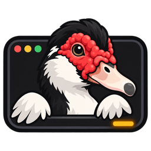

# Vibeke

<p align="center">
  
</p>

<p align="center">
  <a href="https://vibeke.dev">vibeke.dev</a> · <a href="#install">install</a> · <a href="https://vibeke.dev/docs/quickstart">quickstart</a> · <a href="https://vibeke.dev/docs">docs</a> · <a href="spec/">design specs</a>
</p>

<p align="center">
  <a href="LICENSE"></a>
  
  
  
</p>

---

**A terminal workspace for supervising coding agents, on your laptop or a devbox.**

- **Knows what each agent is doing.** Vibeke reads Claude Code, Codex, pi and omp through their hooks, extensions and RPC streams instead of guessing from the screen. Terminal output is only the fallback, and every state says where it came from. [Agents and interactions →](https://vibeke.dev/docs/agents)
- **Answer without hunting for the pane.** Permission requests, questions and plan reviews are real objects. Approve or reply from the sidebar, the inbox or your phone, and the answer goes back through the agent's own channel.
- **Agents outlive the server.** Each pane runs under its own holder process, so a server crash, restart or upgrade doesn't stop running agents. [Process durability →](https://vibeke.dev/docs/holders)
- **One task, one workspace.** `vibeke task new` gives an agent its own worktree, branch and port range, then collects the diff, checks and transcript evidence for review. [Tasks and review →](https://vibeke.dev/docs/tasks)
- **Remote work that feels local.** Connect SSH machines, forward dev servers, and open previews, screenshots and a real browser pane from the devbox in your local terminal. [Remote and previews →](https://vibeke.dev/docs/previews)
- **Isolation when you want it.** Run a task on the host, in an OS sandbox, a container or a VM. If the provider you picked isn't available, the task doesn't start. [Execution and isolation →](https://vibeke.dev/docs/sandboxes)
- **Your phone in the loop.** Pair the web or desktop app with a QR code. Traffic goes through an end-to-end encrypted relay, so the dev host needs no open ports. [Phone and browser →](https://vibeke.dev/docs/mobile)
- **Bring your own harness.** Claude Code, Codex, pi, omp, OpenCode, Gemini CLI, any ACP agent, or your own wrapper described in a TOML manifest.
- **Built to be scripted.** A versioned JSON-RPC API (`vibeke/1`), a CLI on top of it, and an MCP server for agents. [Control API →](https://vibeke.dev/docs/api)
- **Plugins.** Native plugins with declared capabilities. Coming from Herdr? Import your config and layouts and keep your plugins. [Moving from Herdr →](https://vibeke.dev/docs/migrating-from-herdr)
- **One Rust binary.** Ghostty's VT engine inside, and it runs in the terminal you already use.

---

## Install

Vibeke runs on macOS (Apple silicon) and Linux (x86_64, aarch64).

```sh
curl -fsSL https://vibeke.dev/install.sh | sh
```

Install `minisign` first (`brew install minisign` on macOS, or your Linux package manager). The installer writes only inside `$HOME` and verifies the release signature and checksums. See [installation](https://vibeke.dev/docs/install).

[Download the desktop app](https://github.com/MidgardAI/vibeke/releases/latest) for macOS, Linux, or Windows, or open the [browser app](https://app.vibeke.dev). The desktop app connects to a host; local use also requires the CLI.

Then start it in your project:

```sh
cd your-project
vibeke
```

Complete first-run setup, then run `claude`, `codex`, or your usual agent command in a pane. Split panes and step away; `vibeke` reattaches to the same session. Start with the [quickstart](https://vibeke.dev/docs/quickstart).

## Docs

Everything is at [vibeke.dev/docs](https://vibeke.dev/docs): [introduction](https://vibeke.dev/docs/introduction) · [installation](https://vibeke.dev/docs/install) · [your first workspace](https://vibeke.dev/docs/quickstart) · [workspaces and panes](https://vibeke.dev/docs/layout) · [agents and interactions](https://vibeke.dev/docs/agents) · [process durability](https://vibeke.dev/docs/holders) · [tasks and review](https://vibeke.dev/docs/tasks) · [remote and previews](https://vibeke.dev/docs/previews) · [execution and isolation](https://vibeke.dev/docs/sandboxes) · [mobile and desktop](https://vibeke.dev/docs/mobile) · [transfers and shared access](https://vibeke.dev/docs/handoff) · [CLI](https://vibeke.dev/docs/cli) · [configuration](https://vibeke.dev/docs/config) · [control API](https://vibeke.dev/docs/api) · [security model](https://vibeke.dev/docs/security)

The design specs live in [`spec/`](spec/), starting with [vision and scope](spec/00-vision-and-scope.md) and [architecture](spec/01-architecture.md).

## Development

[mise](https://mise.jdx.dev/) pins every toolchain (Rust, Zig for the vendored VT engine, bun for the web apps and the pi extension).

```sh
git clone https://github.com/MidgardAI/vibeke
cd vibeke
mise install

mise run build   # debug build of the workspace
mise run test    # all tests (cargo nextest)
mise run ci      # formatting, lints and tests, as CI runs them
```

## License

Vibeke is licensed under the [Apache License 2.0](LICENSE).
